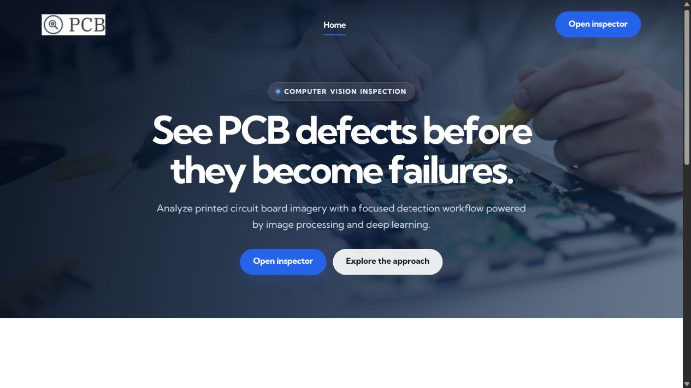
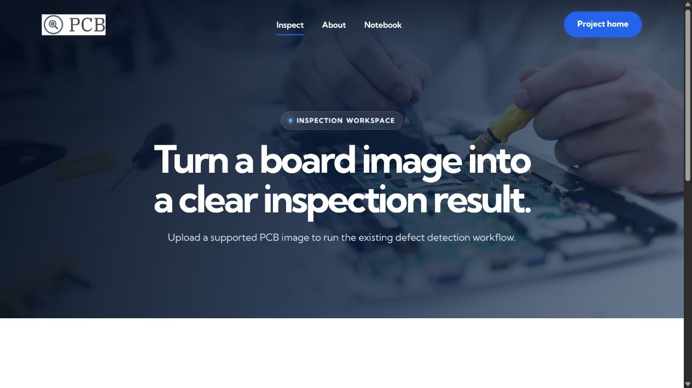
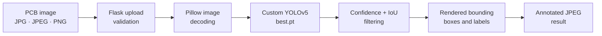
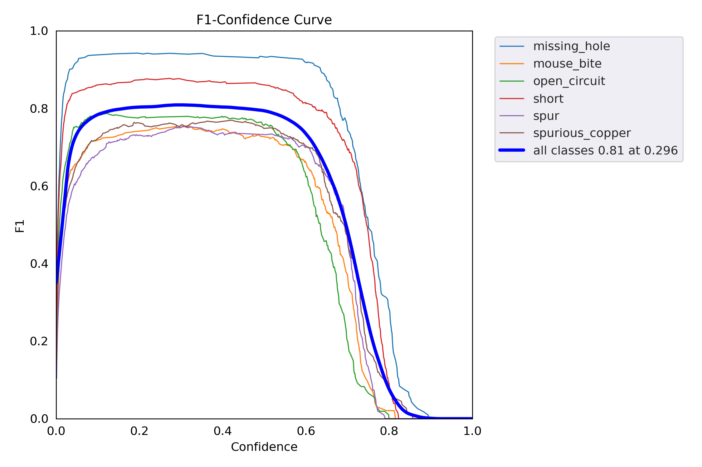

<div align="center">

# PCB Defect Detection 

https://obligations-barnes-listed-reading.trycloudflare.com/

https://huggingface.co/spaces/lkarthik/pcb-vision
### Deep-learning PCB defect detection with YOLOv5

Upload a printed circuit board image, run a trained object detector, and receive an annotated inspection result through a focused Flask interface.

[](https://www.python.org/)
[](https://flask.palletsprojects.com/)
[](https://pytorch.org/)
[](https://www.docker.com/)
[](LICENSE)

</div>



## Overview

PCB Vision is a computer-vision application for locating common manufacturing defects in printed circuit board imagery. A custom YOLOv5 model is loaded from `best.pt`, exposed through Flask, and paired with a responsive upload interface.

The inference path currently:

- accepts JPG, JPEG, and PNG files up to 10 MB;
- evaluates images at an inference size of `415`;
- filters predictions with a `0.50` confidence threshold;
- applies a `0.45` IoU threshold;
- renders predicted regions onto the source image;
- returns the annotated result as a JPEG.

## Detection classes

The dataset configuration defines six PCB defect categories:

| Class | Description |
| --- | --- |
| `missing_hole` | Expected drilled hole is absent |
| `mouse_bite` | Irregular edge notch resembling a bite |
| `open_circuit` | Broken conductive path |
| `short` | Unintended connection between conductive paths |
| `spur` | Unwanted copper projection from a trace |
| `spurious_copper` | Excess or isolated copper region |

## Interface

<table>
  <tr>
    <td width="50%"></td>
    <td width="50%"></td>
  </tr>
  <tr>
    <td align="center"><strong>Project landing page</strong></td>
    <td align="center"><strong>Inspection workspace</strong></td>
  </tr>
</table>

The interface includes responsive navigation, drag-and-drop upload feedback, visible keyboard focus, semantic labels, subtle reveal motion, and a reduced-motion fallback.

## How it works



1. The browser submits an image to the `/predict` endpoint.
2. Flask reads the uploaded bytes and Pillow creates an image object.
3. YOLOv5 performs object detection using the trained weights.
4. The model renders the accepted predictions on the image.
5. Flask saves the annotated image under `static/` and redirects to the result.

## Model evaluation visuals

<details>
<summary><strong>View precision, recall, confusion matrix, and mAP plots</strong></summary>

<br>

| Precision and recall | Confusion matrix | mAP comparison |
| --- | --- | --- |
|  | .png) | .png) |

</details>

## Technology stack

| Layer | Technology |
| --- | --- |
| Detection | YOLOv5, PyTorch, torchvision |
| Image processing | Pillow, OpenCV, NumPy |
| Application | Flask, Jinja2 |
| Interface | HTML, CSS, JavaScript, Bootstrap 4 |
| Data and evaluation | pandas, Matplotlib, seaborn, SciPy |
| Packaging | Docker, Git LFS |

## Quick start with Docker

### Prerequisites

- [Docker](https://docs.docker.com/get-docker/)
- [Git LFS](https://git-lfs.com/)

```bash
git clone https://github.com/karthikLagudu/PCB-Defect-Detection.git
cd PCB-Defect-Detection
git lfs pull

docker build -t pcb-vision .
docker run --rm -p 7860:7860 pcb-vision
```

Open [http://localhost:7860](http://localhost:7860).

## Local installation

Python 3.9 is recommended to match the Docker environment.

```bash
git clone https://github.com/karthikLagudu/PCB-Defect-Detection.git
cd PCB-Defect-Detection
git lfs pull

python -m venv venv
```

Activate the environment:

```bash
# Windows PowerShell
venv\Scripts\Activate.ps1

# macOS or Linux
source venv/bin/activate
```

Install the CPU build of PyTorch and the remaining dependencies:

```bash
python -m pip install --upgrade pip
pip install torch torchvision --index-url https://download.pytorch.org/whl/cpu
pip install -r requirements_deploy.txt
python app.py
```

The application starts on `http://localhost:7860` by default. Set the `PORT` environment variable to use another port.

## Project structure

```text
PCB-Defect-Detection/
├── app.py                     # Flask routes and inference pipeline
├── best.pt                    # YOLOv5 weights managed by Git LFS
├── data/data.yaml             # Six-class dataset configuration
├── templates/                 # Flask/Jinja interface pages
├── static/
│   ├── assets/css/            # Shared and modern UI styles
│   ├── assets/js/             # Interaction and reveal behavior
│   └── assets/img/            # Interface and PCB imagery
├── docs/images/               # Repository screenshots
├── Notebook.ipynb             # Experiment and analysis notebook
├── Dockerfile                 # Reproducible container image
└── requirements_deploy.txt    # Cloud/headless dependencies
```

## Routes

| Route | Purpose |
| --- | --- |
| `/` | Project landing page |
| `/index` | Image inspection workspace |
| `/predict` | Image upload and YOLOv5 inference |
| `/about` | Model evaluation visuals |
| `/notebook` | Exported project notebook |
| `/video` | Webcam detection stream when a camera is available |

## Dataset

The included configuration references a six-class PCB defect dataset exported in YOLOv5 PyTorch format. The dataset documentation reports 1,385 images and includes attribution metadata in `data/data.yaml` and `data/README.roboflow.txt`.

## Notes

- `best.pt` is stored with Git LFS. Run `git lfs pull` after cloning.
- CPU inference is supported; startup can take time while the model is loaded and fused.
- The webcam route requires an accessible camera and is expected to be unavailable in headless deployments.
- The Flask development server is suitable for local use. Use an appropriate production server or container platform for public deployment.

## License

This project is available under the [MIT License](LICENSE).

## Acknowledgements

- [Ultralytics YOLOv5](https://github.com/ultralytics/yolov5)
- [PyTorch](https://pytorch.org/)
- Dataset tooling and export metadata from [Roboflow](https://roboflow.com/)

<div align="center">
  <strong>PCB Vision · clearer inspection through computer vision</strong>
</div>
